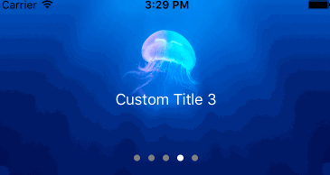

#PAImagePlayerView 
Version 0.0.1

you can easily use PAImagePlayerView to cycle display pictures.



##  Installation:

#### Manually:

1、Clone this project
`git clone git@github.com:pauleryliu/PAImagePlayerView.git`  
2、Drag the PAImagePlayerView folder to your project  
3、Add `#import "PAImagePlayerView.h"` , where you want to use  

## Usage

#### Init

```
    PAImagePlayerView *playerView = [[PAImagePlayerView alloc] initWithFrame:CGRectMake(0, 0,self.view.frame.size.width, 200) scrollDirection:UICollectionViewScrollDirectionHorizontal];
    playerView.pa_DataSource = self;  
    playerView.pa_Delegate = self;  
    [self.view addSubview:playerView];  
```

#### DataSource (Required)

```
#pragma mark -- PAImagePlayerViewDataSource

- (NSInteger)numberOfPagesInPAImagePlayerView:(PAImagePlayerView*)paImagePlayerView
{
	// number of pages
    return 5;
}

- (UIView*)customViewInPAImagePlayerView:(PAImagePlayerView*)paImagePlayerView atIndex:(NSInteger)index
{
	// create custom view you need
    UIView *customView = [[UIView alloc] initWithFrame:CGRectMake(0, 0, paImagePlayerView.frame.size.width, paImagePlayerView.frame.size.height)];
    
    // ... add other subviews 
    UILabel *titleLabel = [[UILabel alloc] initWithFrame:CGRectMake(0,100, paImagePlayerView.frame.size.width, 30)];
    titleLabel.text = [NSString stringWithFormat:@"Custom Title %d",(int)index];
    titleLabel.textColor = [UIColor whiteColor];
    titleLabel.textAlignment = NSTextAlignmentCenter;
    [customView addSubview:titleLabel];
    
    return customView;
}

```

#### Delegate (Optional)

```
#pragma mark -- PAImagePlayerViewDelegate

- (BOOL)PAImagePlayerView:(PAImagePlayerView*)paImagePlayerView shouldSelectAtIndex:(NSInteger)index
{
    return NO;
}

- (void)PAImagePlayerView:(PAImagePlayerView*)paImagePlayerView didSelectAtIndex:(NSInteger)index
{
    NSLog(@"playerView %@ index %d",paImagePlayerView,(int)index);
}
```

#### Properties

```
// set current index
- (void)pa_setCurrentIndex:(NSInteger)currentIndex;

// set auto scroll , default is YES
- (void)pa_setAutoPerformAnimationScroll:(BOOL)isAutoAnimationScroll;

// set auto scroll interval , default is 2 seconds
- (void)pa_setAutoPerformAnimationScrollInterval:(NSTimeInterval)animationInterval;
```


## Requirements

the library requires a deployment target of iOS 6.0 or greater

## License

PAImagePlayerView is released under the MIT license. See LICESE file for details.

## Contact

Email : pauleryliu@gmail.com
